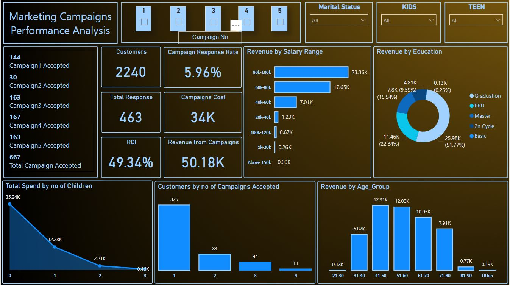
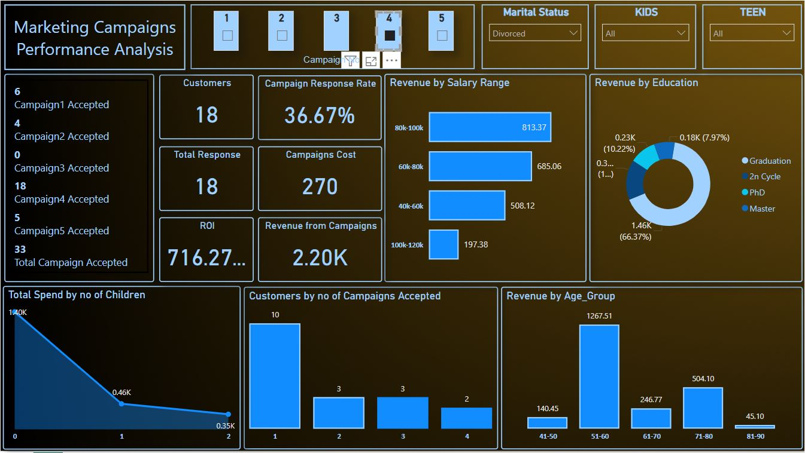
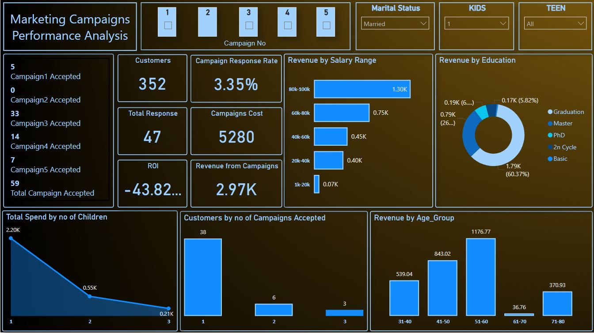

# Marketing-Campaign-Analysis
Analyze the performance of marketing campaigns to identify trends  and ROI. 
This Power BI dashboard visualizes key performance indicators (KPIs) for five marketing campaigns, enabling clear insights into customer behavior, campaign success, and revenue generation trends.

**🔍 Visual Overview
* Campaign Overview Cards: Display the number of campaign acceptances per campaign, total responses, customers reached, campaign costs, ROI, and total revenue.

* Campaign Filters: Interactive buttons allow users to isolate data by individual campaign numbers for focused analysis.

* Demographic Filters: Dropdowns for Marital Status, presence of Kids, and Teens allow further segmentation of the audience.

* Bar Chart – Revenue by Salary Range: Highlights which income groups contribute most to revenue, helping refine future targeting strategies.

* Donut Chart – Revenue by Education: Breaks down revenue contribution by education level, revealing the most profitable customer profiles.

* Line & Area Chart – Spend by Number of Children: Visualizes how total customer spending varies with the number of children in the household.

* Bar Chart – Customers by Campaigns Accepted: Indicates how many campaigns each customer accepted, identifying engagement levels.

* Bar Chart – Revenue by Age Group: Shows which age groups drive revenue, aiding demographic-based targeting.

  
  
  
